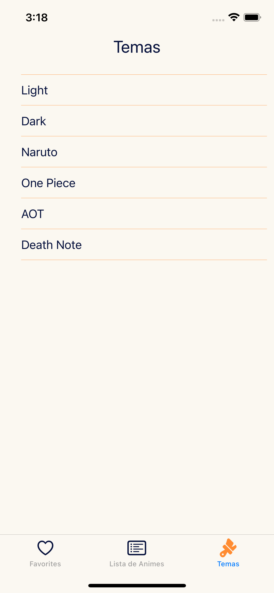
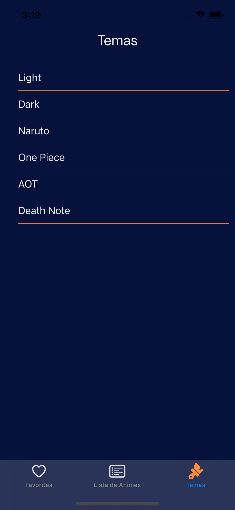

# Anime Favorite


> iOS App Anime using [Jikan API](https://docs.api.jikan.moe)

## Key Features
- [Swift](https://www.apple.com/br/swift/)
- [UIKit](https://developer.apple.com/documentation/uikit/)
- MVVM
- [CocoaPods](https://cocoapods.org)
- View Code

## Frameworks
- Kingfisher - https://github.com/onevcat/Kingfisher
- Realm - https://github.com/realm
- Cosmos - https://github.com/evgenyneu/Cosmos
- Youtube iOS Player Helper - https://github.com/youtube/youtube-ios-player-helper
- Snapkit - https://github.com/SnapKit/SnapKit
- Moya - https://github.com/Moya/Moya
- Lottie - https://github.com/airbnb/lottie-ios

## Installation
### You must have already installed
- [Xcode 12.5+](https://developer.apple.com/xcode/)
### Recommendations
It is recommended that you have at least the macOS BigSur
### Steps
1. Clone this repository
```
git clone https://github.com/thonatas/AnimeFavorite.git
```
2. Open the Xcode project
```
open .xcworkspace
```
3. Run simulator

## Views
| Views | Description  |
| ----------  | ----------  | 
| [Favorite](AnimeFav/Features/Favorite/FavoriteViewController.swift) | Present favorited animes by user, buildind with UICollectionView and UICollectionViewCell. |
| [Animes List](AnimeFav/Features/AnimeList/AnimeListViewController.swift) | Present a list of anime ranked by member, score and rating. Also, it is possible to search for other animes that are not in the list. Building with UITableView and UITableViewCell |
| [Anime Details](AnimeFav/Features/AnimeDetails/AnimeDetailsViewController.swift) | Shows selected anime details such as number of episodes, rating, synopsis, etc. You get to favorite the selected anime, in which case, the selected anime is saved locally. |
| [Themes](AnimeFav/Features/Themes/Scenes/ThemesViewController.swift) | Displays the list of available themes. |

## License
This project could be used by anyone! MIT License

## Screenshots
### Basic Themes
| Basic Themes | Favorites  |  Animes List  |  Anime Details  |  Themes  |
| ----------  | ----------  |  ---------  |  -------  |  -------  |
| _Light_ |   |   |   |   |
| _Dark_ |   |   |   |   |

### Custom Themes
| Custom Themes | Naruto  |  One Piece  |  AOT  |  Death Note  |
| ----------  | ----------  |  ---------  |  -------  |  -------  |
| _Anime Themes_ |   |   |   |   |

### Others
| Others | Trailer Portrait  |  Trailer Full Screen  |  Loading  |  Launching Animation  |
| ----------  | ----------  |  ---------  |  -------  |  -------  |
| _Screens_ |   |   |   |   |
